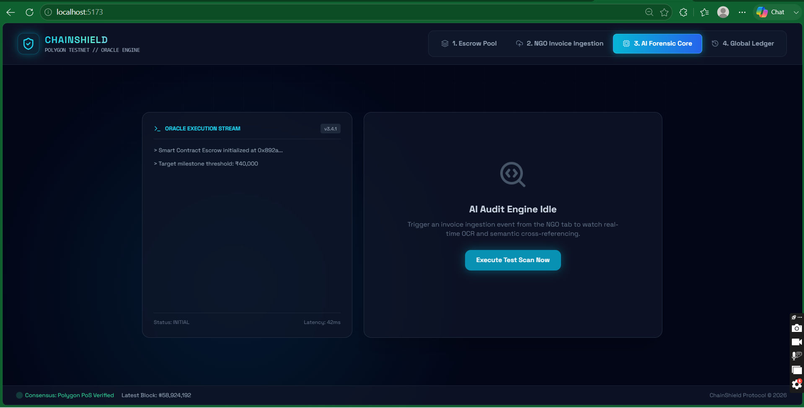
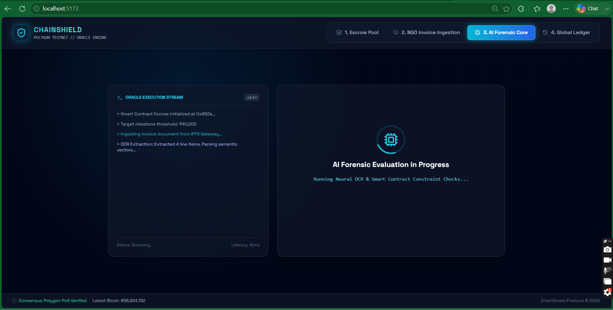
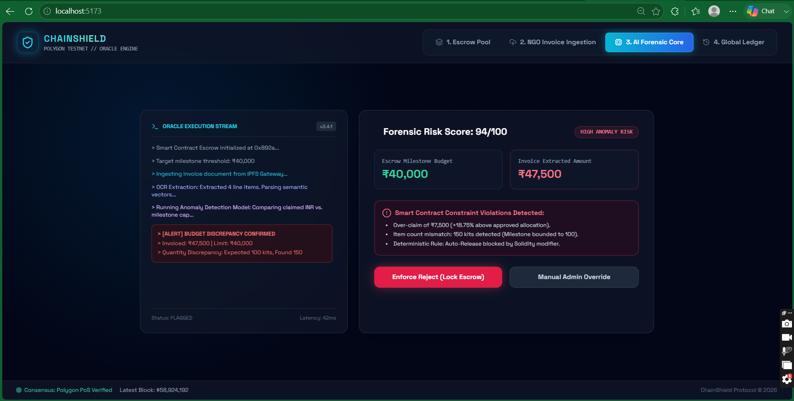
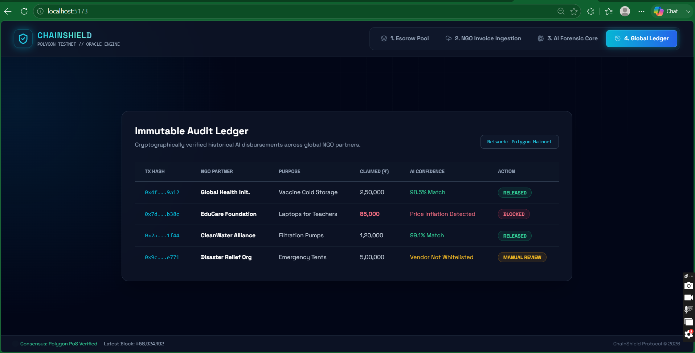
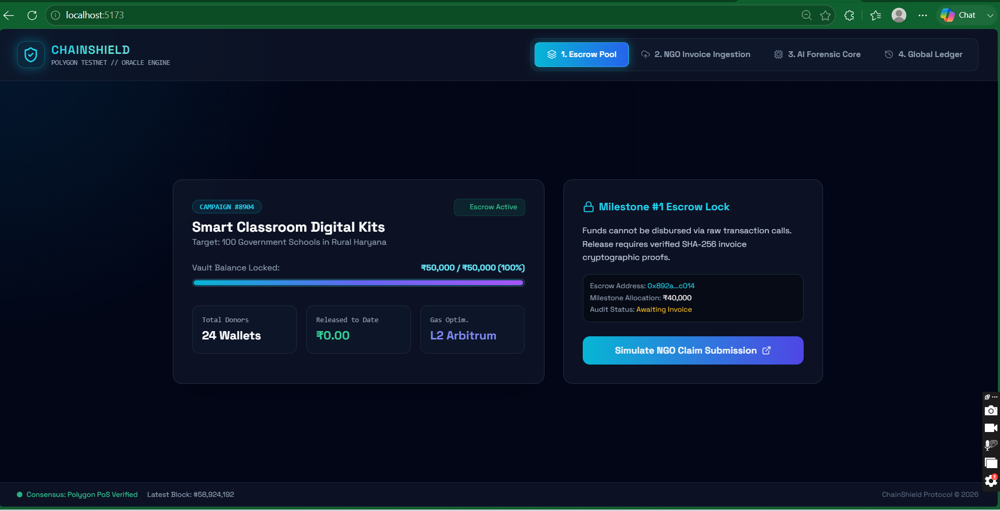
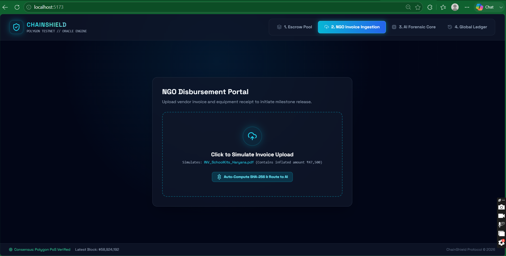
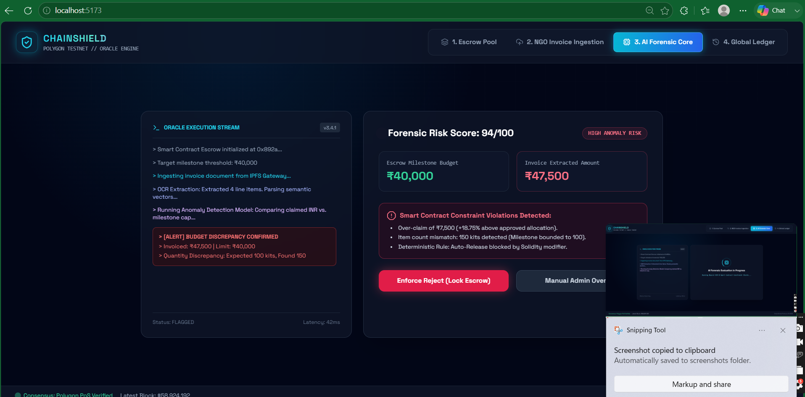
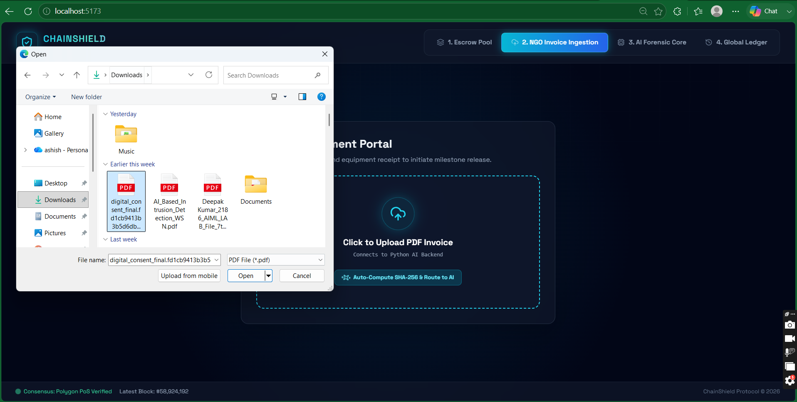

# ChainShield

A Web3-enabled AI-driven NGO fund auditing platform designed to prevent fund leakage and ensure transparent resource distribution.

## Project Demo

## Tech Stack
* **Frontend:** React Tailwind CSS
* **Backend AI Core:** Python FastAPI
* **Smart Contracts:** Solidity Hardhat Polygon Testnet
* **Validation:** SHA-256 Cryptographic Hashing AI Anomaly Detection

## Local Setup
1. Start the backend: cd backend -> python -m uvicorn main:app --reload --port 8000
2. Start the frontend: cd frontend -> npm run dev
3. Access the UI at http://localhost:5173/
